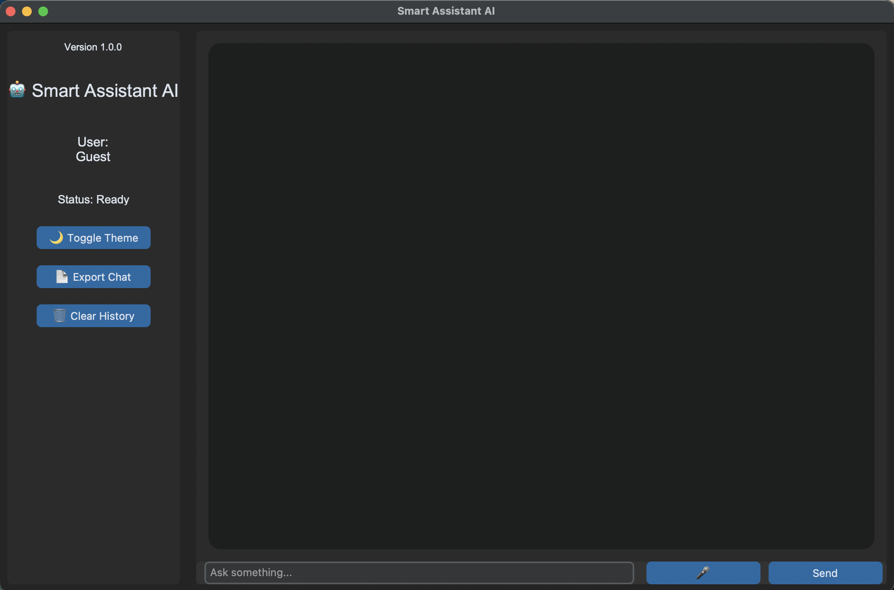
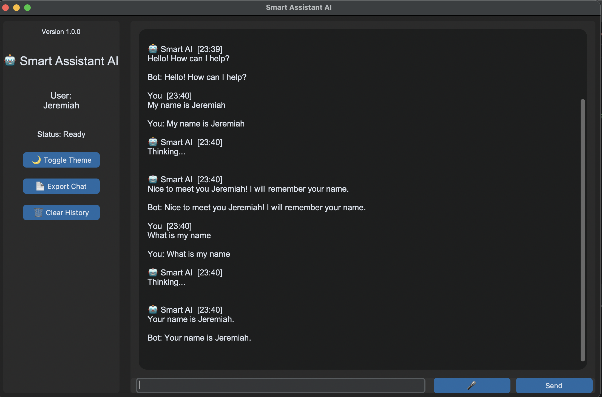
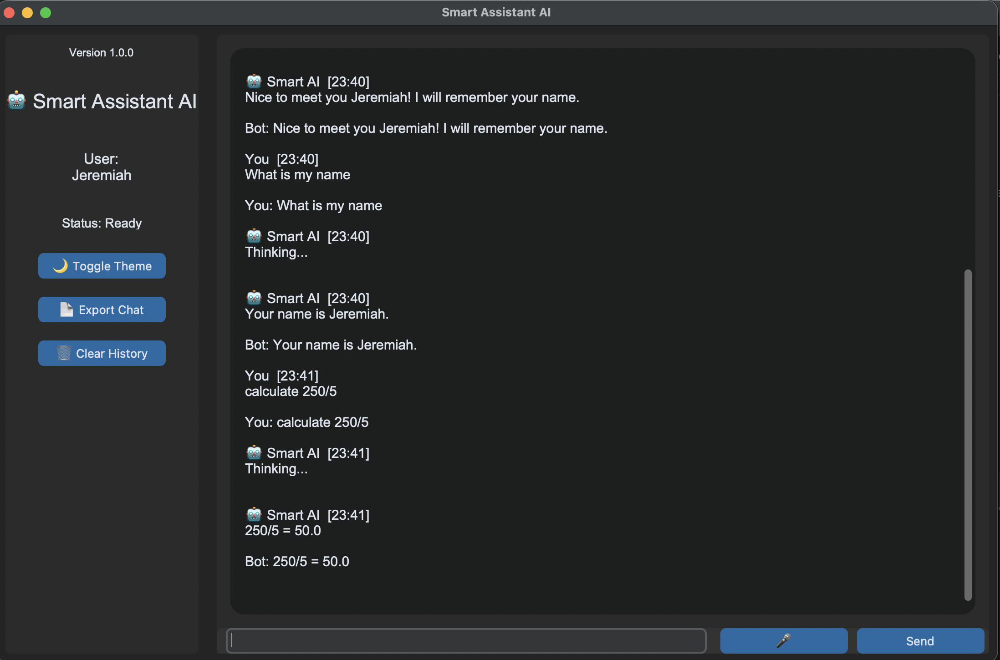
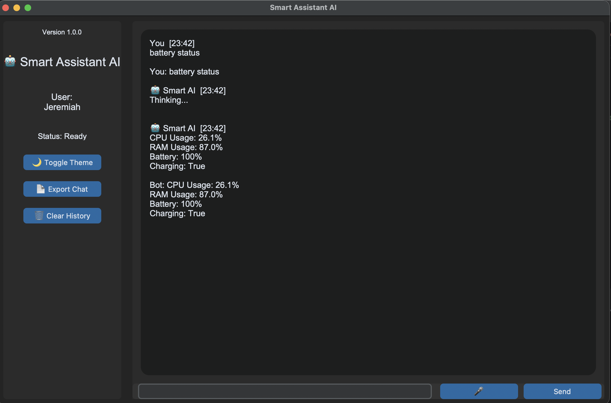

# Smart Assistant AI 🤖

A Python-based desktop AI assistant application built with a modern graphical interface, API integrations, persistent memory, voice synthesis, and native macOS deployment.

## Overview

Smart Assistant AI is a personal desktop assistant designed to demonstrate software engineering concepts including:

- GUI application development
- API integration
- Data persistence
- Modular software architecture
- Voice interaction
- Application packaging and deployment

The application was developed using Python and deployed as a native macOS application.

---

# Features

## 💬 AI Chat Interface
- Interactive desktop chat window
- Conversation history tracking
- Modular chatbot architecture

## 🧠 Persistent Memory
- Stores user preferences
- Remembers user information
- Maintains conversation history

Memory storage:
~/Library/Application Support/SmartAssistantAI

## 🔊 Voice Response

Text-to-speech functionality allows the assistant to read responses aloud.

## 🧮 Calculator Module

Built-in calculator functionality for quick calculations.

Examples:
calculate 25 * 4

## 🌐 Information Lookup

Wikipedia integration for general information queries.

Example:
wiki Python programming

## 📊 System Monitoring

Displays system information and resource usage.

---
# Current Status

✅ Desktop GUI

✅ Voice Responses

✅ Persistent Memory

✅ Calculator

✅ Dictionary

✅ Wikipedia

✅ System Monitor

✅ File Search

✅ App Launcher

🚧 Weather API (works but is currently being updated)
---

# Technologies Used

| Technology | Purpose |
|---|---|
| Python | Core application language |
| CustomTkinter | Desktop GUI |
| PyInstaller | macOS application packaging |
| JSON | Persistent storage |
| REST APIs | External data access |
| pyttsx3 | Text-to-speech |
| Git/GitHub | Version control |

---

# Project Architecture
Smart Assistant AI
      User
       |
       v
 CustomTkinter GUI
       |
       v
  Chat Controller
       || | |
Memory APIs Utilities
|
JSON Storage
       |
       v

   Voice Engine

---
# Project Structure

SmartAssistantAI/
│
├── api/
├── assets/
├── calculator/
├── gui/
├── memory/
├── system/
├── utilities/
│
├── chatbot.py
├── main.py
├── requirements.txt
└── README.md
---

## 📸 Screenshots

### Main Interface

### Memory System

### Calculator

### System Monitor

---

# Installation

Clone repository:

</>bash git clone https://github.com/YOUR_USERNAME/SmartAssistantAI.git
Navigate:
</>Bash cd SmartAssistantAI  

Create environment:
</> Bash python3 -m venv .venv

Activate:

Mac/Linux:
</> Bash source .venv/bin/activate

Install dependencies:
</> Bash pip install -r requirements.txt

Run:
</> Bash python main.py 

macOS Application

The project can be packaged into a native macOS application:
</> Bash pyinstaller "Smart Assistant AI.spec"

Generated application:
Smart Assistant AI.app

Future Improvements
• Local LLM integration
• Voice input
• SQLite database backend
• Plugin system
• Cloud synchronization
• User authentication

Author
Jeremiah Lupton
Python Developer | Engineering Technology Portfolio Project
